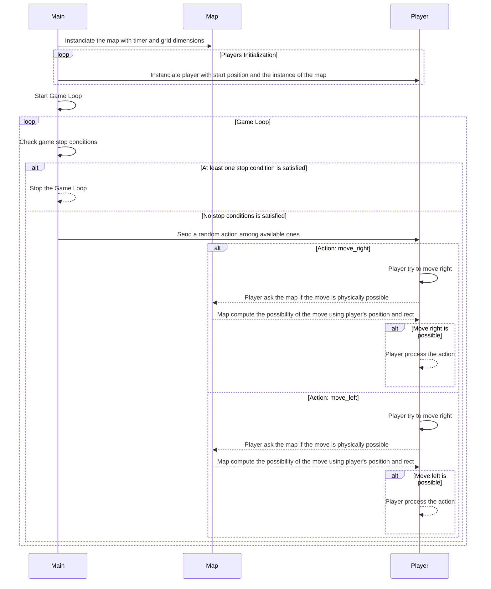
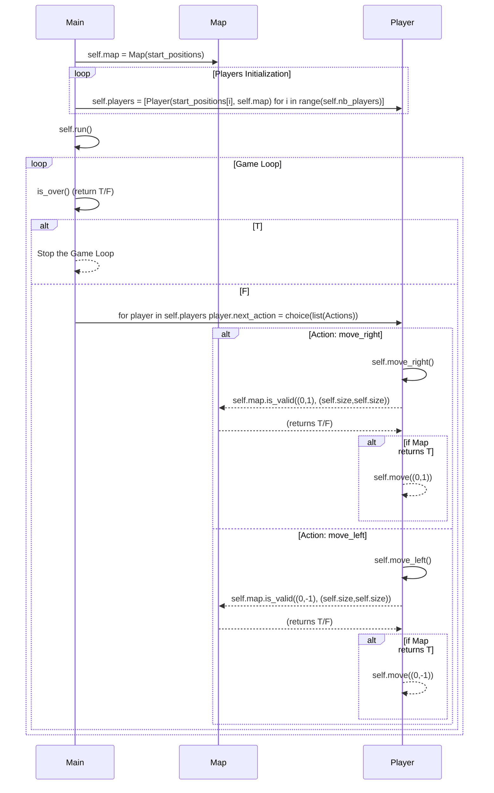
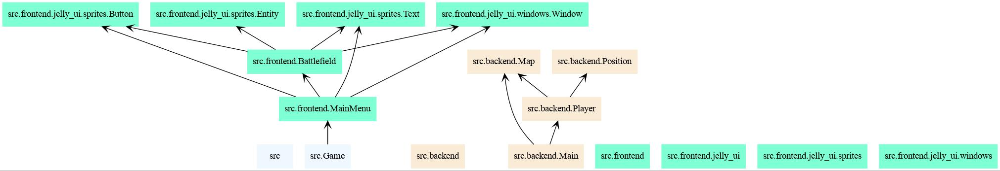

# punching-jellies
AI-based Jelly-fighting cubes game.

## BACKEND

### Logic Sequence Diagram

```mermaid
    sequenceDiagram
        participant Main
        participant Map
        participant Player

        Main->>Map: Instanciate the map with timer and grid dimensions
        loop Players Initialization
            Main->>Player: Instanciate player with start position and the instance of the map
        end

        Main->>Main: Start Game Loop

        loop Game Loop
            Main->>Main: Check game stop conditions
            alt At least one stop condition is satisfied
                Main-->>Main: Stop the Game Loop
            else No stop conditions is satisfied
                Main->>Player: Send a random action among available ones
                alt Action: move_right
                    Player->>Player: Player try to move right
                    Player-->>Map: Player ask the map if the move is physically possible
                    Map-->>Player: Map compute the possibility of the move using player's position and rect
                    alt Move right is possible
                        Player-->>Player: Player process the action
                    end
                else Action: move_left
                    Player->>Player: Player try to move right
                    Player-->>Map: Player ask the map if the move is physically possible
                    Map-->>Player: Map compute the possibility of the move using player's position and rect
                    alt Move left is possible
                        Player-->>Player: Player process the action
                    end
                end
            end
        end
```

### Functional Sequence Diagram

```mermaid
    sequenceDiagram
        participant Main
        participant Map
        participant Player

        Main->>Map: self.map = Map(start_positions)
        loop Players Initialization
            Main->>Player: self.players = [Player(start_positions[i], self.map) for i in range(self.nb_players)]
        end

        Main->>Main: self.run()

        loop Game Loop
            Main->>Main: is_over() (return T/F)
            alt T
                Main-->>Main: Stop the Game Loop
            else F
                Main->>Player: for player in self.players player.next_action = choice(list(Actions))
                alt Action: move_right
                    Player->>Player: self.move_right()
                    Player-->>Map: self.map.is_valid((0,1), (self.size,self.size))
                    Map-->>Player: (returns T/F)
                    alt if Map returns T
                        Player-->>Player: self.move((0,1))
                    end
                else Action: move_left
                    Player->>Player: self.move_left()
                    Player-->>Map: self.map.is_valid((0,-1), (self.size,self.size))
                    Map-->>Player: (returns T/F)
                    alt if Map returns T
                        Player-->>Player: self.move((0,-1))
                    end
                end
            end
        end
```

### Projects UML

    

