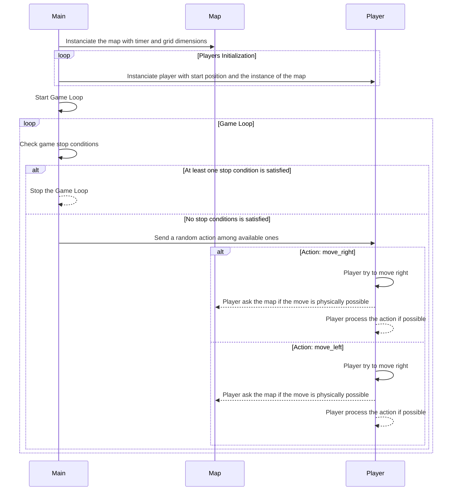

# punching-jellies
AI-based Jelly-fighting cubes game.

```mermaid
    sequenceDiagram
        participant Main
        participant Map
        participant Player

        Main->>Map: Instanciate the map with timer and grid dimensions
        loop Players Initialization
            Main->>Player: Instanciate player with start position and the instance of the map
        end

        Main->>Main: Start Game Loop

        loop Game Loop
            Main->>Main: Check game stop conditions
            alt At least one stop condition is satisfied
                Main-->>Main: Stop the Game Loop
            else No stop conditions is satisfied
                Main->>Player: Send a random action among available ones
                alt Action: move_right
                    Player->>Player: Player try to move right
                    Player-->>Map: Player ask the map if the move is physically possible
                    Player-->>Player: Player process the action if possible
                else Action: move_left
                    Player->>Player: Player try to move right
                    Player-->>Map: Player ask the map if the move is physically possible
                    Player-->>Player: Player process the action if possible
                end
            end
        end
```